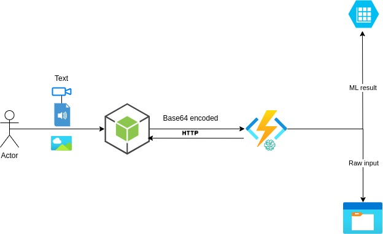
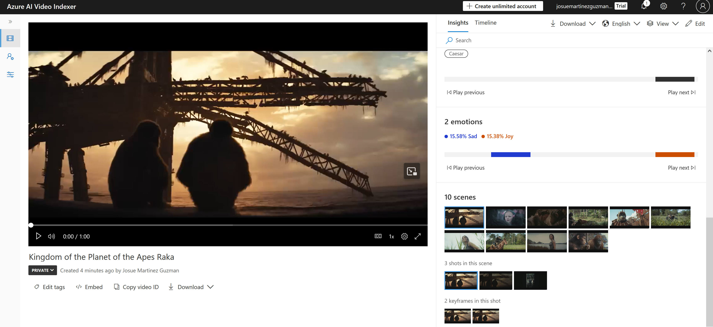

# Cloud Architecture Project - ForgeAI


## Introduction
<b>Project Description</b>: Forge AI is an all-in-one plataform for AI models. It will provide tools in the area of Image, Text, Video, and Sound. Furthermore, we plan to implement our own video captioning model, as it is seen that not much has been done into this subset of AI.

## Team Members

<ul>
    <li>Gabriel Witte</li>
    <li>Josue Martinez</li>
    <li>Shaheryaar Zia</li>
    <li>Victor Owolabi</li>
    <li>Ulriche Tankeu</li>
</ul>

## Use Cases

<b>Text</b>: Question & Answering
<br>
<b>Image</b>: Image captioning
<br>
<b>Sound</b>: Transcription
<br>
<b>Video</b>: Movie Summarizer

## Features

- **Multi-Mode Messaging**: Text, Audio, Image, and Video.
- **Real-Time Responses**: Receive responses from an API.
- **Message History**: Fetch and display past messages.
- **Responsive UI**: Built with React and Tailwind CSS.
- **File Handling**: Upload and handle various file types.


# Image captioning

The Image captioning model consist of caption generation from an uploaded video, video to images conversion, Image to text generator and a summarizer model.

## Architecture
A simple architecture was chosen to reduce computation costs. 
The application consists of a React frontend and several backend services hosted on Azure. The frontend interacts with the backend through HTTP APIs to process messages and retrieve histories.


## Frontend Components

### App

The root component, maintaining the state and rendering `Dashboard` and `ChatArea`.

### Dashboard

Allows users to switch between different messaging modes.

### NavItem

Represents a navigational item in the `Dashboard`.

### ChatArea

Manages and displays the message history, fetching data from the API.

### ChatboxArea

Provides input fields for sending messages based on the current mode.

### Box

Renders individual messages and responses, displaying content based on the type (Text, Audio, Image, Video).

## Backend Services

### Video Caption Generator and Summarizer

Processes base64-encoded video data, generates captions, summarizes them, and stores the result in Azure Blob Storage.

### Image Caption Generator

Processes base64-encoded images, generates captions, and stores the result in Azure Blob Storage.

### Audio to Text Transcription

Transcribes audio files to text using OpenAI's Whisper model and stores the result in Azure Blob Storage.

### Text-to-Text Generation

Generates text responses using the GPT-3.5-turbo model and stores the result in Azure Blob Storage.

### HTTP Run Function

Processes various data types (text, audio, video, image) and generates corresponding text outputs using different models.

### HTTP History Retrieval

Retrieves the history of processed requests and responses stored in Azure Table Storage and Azure Blob Storage.

### Database Schema

- **Messages Table**: Stores all user messages.
- **Responses Table**: Stores API responses to messages.

### Styling

Uses Tailwind CSS for a modern and responsive design.

## Instructions
Incase the necessary resources needed to run this service has not yet been creates, run the <b>deploy_azure_resouces.sh</b> locally to set up the resources. This is a temporary solution because logging into azure from gitlab cicd pipeline throws a ssl certificate error.

then trigger the .gitlab-ci.yml file to build and push the docker image into the azure registory which will bw automatically picked up by the already created functionapp.

The blob trigger function can be triggered by uploading an mp4 video into the azure blob storage which will process the blob. 

The resulting caption can be queried by sending an http request to the http trigger. Just paste https://forgefunctionapp.azurewebsites.net/api/http_trigger_function?filename=imagefiles/{filename} into your browser.

## Names of resources 

<b>Resource group</b>: ForgeAIGroup
<br>
<b>FunctionApp</b>: forgefunctionapp
<br>
<b>storage</b>: forgestorage
<br>
<b>Container</b>: imagefiles
<br>
<b>Docker registory</b>: forgeacr
<br>
<b>Queue</b>: forgeaiartifacts


## Azure AI Video Indexer
Azure Video Indexer is a cloud application built on Azure Media Services and Azure Cognitive Services (such as the Face, Translator, Computer Vision, and Speech).

[Intro](https://azure.microsoft.com/en-us/products/ai-video-indexer)

[API Reference](https://learn.microsoft.com/en-us/rest/api/videoindexer/)


After uploading [Kingdom of the Plante of the Apes Trailer](https://www.youtube.com/watch?v=TBlTMBY19-0&t=11s) the service extracts insights on Topics, Audio Effects
Key Words, Labels, Named Entities, Emotions, Scenes. It also has a timeline of the script.



 __FFMPEG__ - Use this to extract images from video. Download it [here](https://ffmpeg.org/download.html)


FFMPEG Command to extract images from video: 
```bash
FFMPEG -i {path to video} -qscale:v 1 -qmin 1 -vf fps={frame extraction rate} %04d.jpg
```
FFMPEG can be used for multiple things like Video scaling and pixel format converter
Audio resampler
Encoders and decoders (codecs)
Bitstream filters
Muxers and demuxers (formats)
Protocols
Input and output devices
Filters
You can find the documentation [here](https://ffmpeg.org/documentation.html) that is why comes in quiet handy while working with ML/Video/pixels related stuff.

